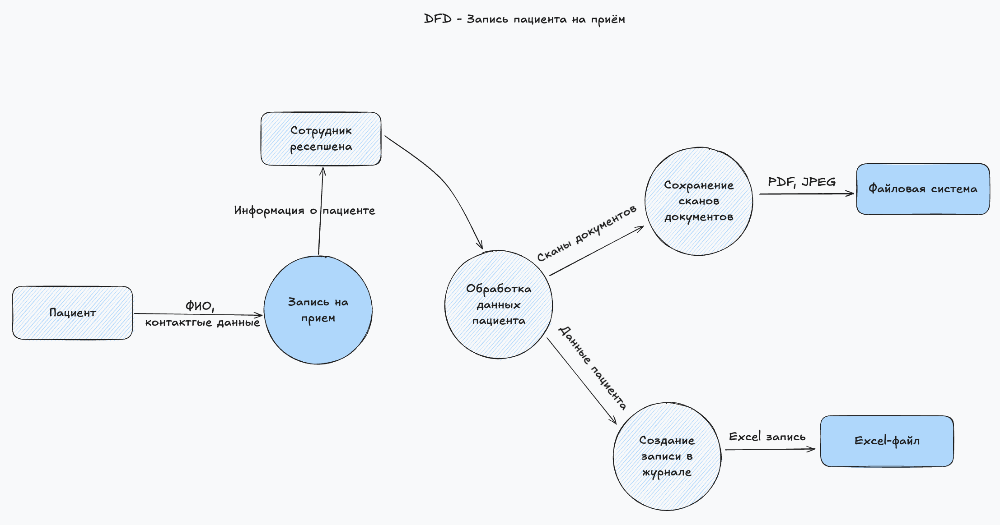
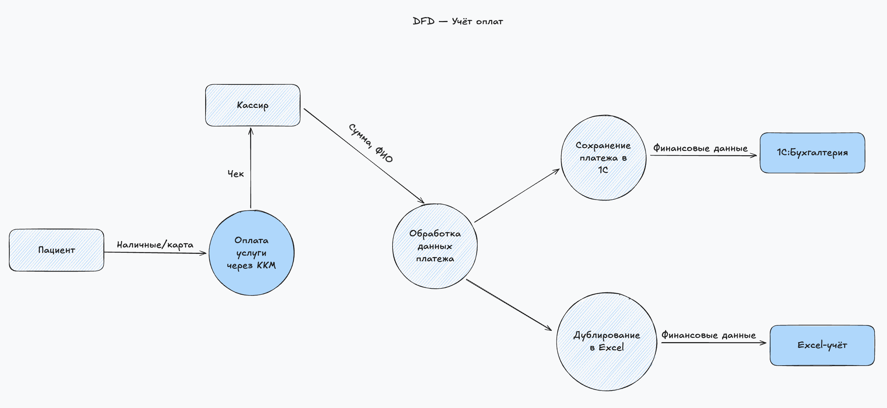
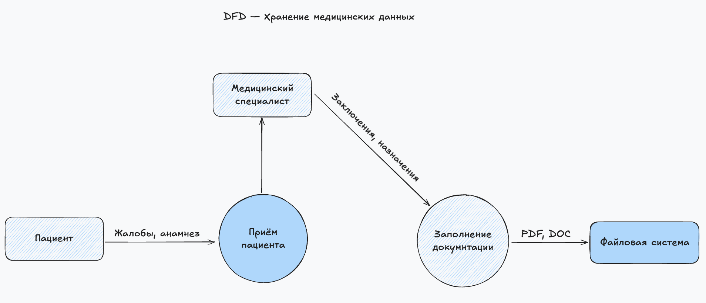
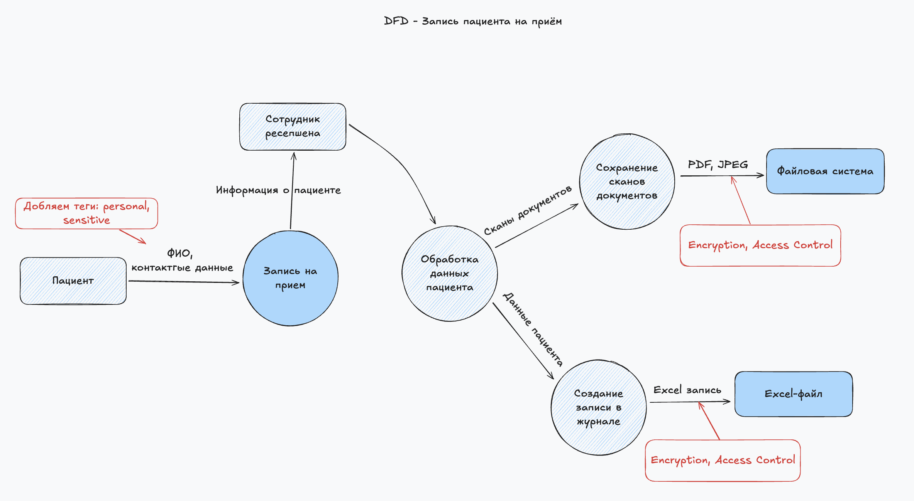
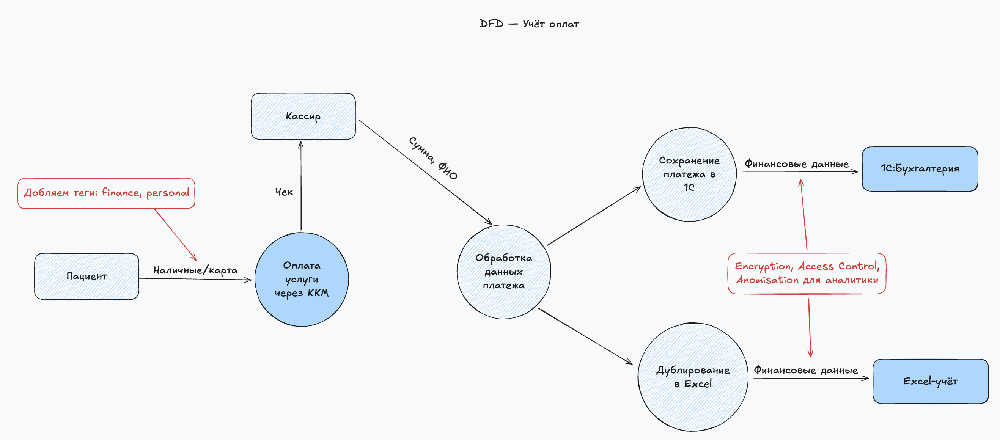
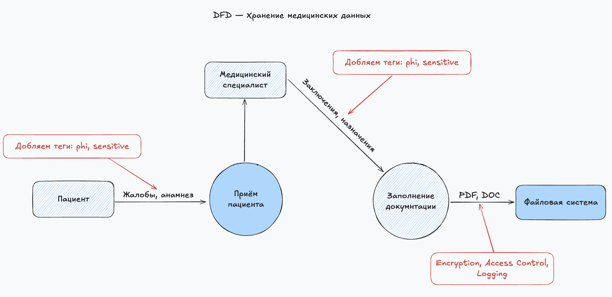

## Задание 1. Анализ безопасности системы

### 1. Диаграммы потоков данных 

Диаграмма потоков данных для записи на прием 

Диаграмма потоков данных для оплаты услуг

Диаграмма потоков данных для приема пациента

---

### 2. Проблемные зоны обеспечения безопасности данных

| Категория               | Уязвимость                                                                                     |
|-------------------------|------------------------------------------------------------------------------------------------|
| Хранение данных         | Персональные и медицинские данные хранятся в Excel-файлах и 1С без шифрования, на локальных ПК |
| Передача данных         | Обмен PII и мед. данных по Email, мессенджерам без шифрования                                  |
| Доступ и учетные записи | Отсутствует разграничение прав доступа, используются общие логины                              |
| Журналирование          | Нет логирования доступа и операций с конфиденциальными данными                                 |
| Резервное копирование   | Резервные копии не централизованы, не шифруются, могут храниться на том же устройстве          |
| Интеграции с внешними   | Передача данных лабораториям и подрядчикам без DPA и контроля                                  |
| Соответствие 152-ФЗ     | Нет классификации ПДн, политики, согласий, реестра обработок                                   |

---

### 3. Список данных и методы их защиты

| Тип данных                             | Способ защиты                         |
|----------------------------------------|---------------------------------------|
| ФИО клиентов                           | Обезличивание, Шифрование, обфускация |
| Паспортные данные                      | Шифрование, Обезличивание             |
| Адрес проживания                       | Обезличивание, Шифрование             |
| Контактные данные (телефон, email)     | Шифрование, Обфускация                |
| Медицинские заключения                 | Шифрование, Обезличивание             |
| Данные о посещениях и диагнозах        | Обезличивание, Шифрование             |
| История оплат, чеки                    | Обезличивание, Обфускация             |
| Данные сотрудников (ФИО, СНИЛС и т.п.) | Шифрование, Обезличивание             |
| Пользовательские действия в системе    | Обфускация, Обезличивание             |
| Фото/сканы документов                  | Шифрование, Обезличивание             |

**Пояснение**
- Шифрование используется, если важна точность данных при передаче или хранении.
- Обезличивание используется, если можно удалять/заменять личные признаки без ущерба для аналитики.
- Обфускация уместна для маскировки данных при отображении или в логах.

---

### 4. Механизм тегирования данных с использованием OneTrust

Наиболее подходящим инструментом для тегирования будет OneTrust, так как:
- Поддерживает тегирование и каталогизацию данных на уровне систем, полей и процессов;
- Имеет гибкую настройку политик классификации (PII, PHI, SPI, Financial, Employment и т.п.);
- Интегрируется с хранилищами, API, DLP-средствами, SIEM, BI и data governance-инструментами;
- Имеет мощные функции для визуализации потоков данных и рисков (data mapping);
- Поддерживает русский язык и адаптацию под 152-ФЗ и GDPR.

| Шаг | Действие                                   | Описание                                                                                                          |
|-----|--------------------------------------------|-------------------------------------------------------------------------------------------------------------------|
| 1   | Инвентаризация данных                      | Используем сканеры OneTrust или ручной импорт схем данных. Инвентаризируем таблицы, поля, API.                    |
| 2   | Определение категорий данных               | Создаём кастомные категории: "Персональные данные", "Медицинская тайна", "Финансовые данные", "Служебные данные". |
| 3   | Настройка тегов (labels)                   | Устанавливаем теги на поля: `sensitive`, `critical`, `personal`, `phi`, `finance`, `employee`.                    |
| 4   | Назначение владельцев данных (Data Owners) | Назначаем ответственных за каждый набор или поток данных.                                                         |
| 5   | Автоматическое тегирование по правилам     | Используем шаблоны: "если поле содержит «паспорт», тег = sensitive+personal".                                     |
| 6   | Визуализация и контроль                    | Генерируем карту потоков данных (Data Flow Map) с отображением тегов и уровней риска.                             |
| 7   | Интеграция с политиками DLP, SIEM, IAM     | Используем метки для блокировки/контроля доступа к данным.                                                        |

---

### 5. Доработанные диаграммы потоков данных

Диаграмма потоков данных для записи на прием 

Диаграмма потоков данных для оплаты услуг

Диаграмма потоков данных для приема пациента

**Обозначения защиты**
- `Encryption` - все данные, содержащие PII, PHI и финансовую информацию, должны храниться и передаваться в зашифрованном виде (например, AES-256);
- `Access Control` - доступ к данным должен регулироваться через ролевую модель (RBAC/ABAC);
- `Anonymization` - при выгрузке данных для BI или передачи в сторонние аналитические системы;
- `Logging` - аудит доступа и изменений для отслеживания несанкционированного доступа.